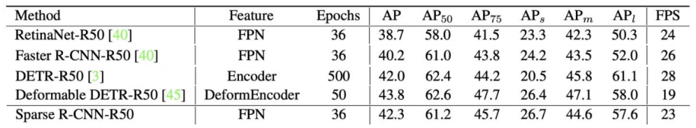
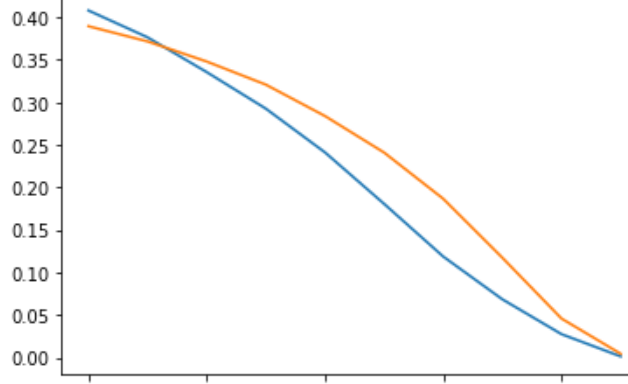

# DETR 和 Sparse RCNN 的知乎回答

(写作花了大概 2h, 审核了 35min)

回答地址: https://www.zhihu.com/question/431890092/answer/1594696884

由于 Sparse RCNN 有受到 DETR 启发, 所以先分析 DETR. 

我觉得 DETR 的成功有两个关键点:

1. Set prediction loss
1. Self-attention 带来的 proposal 之间的强关联性, 使得整个输出结果更加整体

同时, DETR 有个大的缺点, 就是对 local feature 利用不足. 这会导致一个问题: bbox 边界回归不准. 表现为小物体的 mAP 非常低(下图中 APs 比 Sparse RCNN  低了6个点!).

但 mAP_small 低有可能有两个原因:

1. 边界回归不准
1. 漏掉了小物体

为了找到 mAP_small 低的具体原因, 我们对比了一下 DETR 和 MaskRCNN 的 bbox mAP_small 曲线: 

   
*纵坐标:mAP_small. 横坐标: IoU阈值[0.5:1:0.05]. 蓝色 DETR, 橙色 MaskRCNN*

发现 DETR(蓝色) 在 IoU 阈值为 0.5 时候, mAP_small 比 MaskRCNN还高, 所以 DETR 感知到小物体的能力还挺强的, **"边界回归不准"**才是 mAP_small 低的主要原因. 

---

再回到主角 Sparse RCNN, Sparse RCNN 完全继承了 DETR 的两个关键优点:

1. Set prediction loss
1. Proposal 之间的强关联性(iteration+dynamic 机制类比于 self-attention)

同时, 由于 Sparse RCNN 是全卷积的, 具有 CNN local feature 强的优点. 所以在边界回归的准确度上会优于 DETR. 

综上, Sparse RCNN 集成了 DETR 的两个优点, 并摒弃了 transformer 带来的缺点, 并在结果上超过了 DETR. 但老实说, Sparse RCNN 只高了0.3 的 mmAP, 而 mAP50 和 AP_large  上都低了不少, 说明 Sparse RCNN 还有挺多进步空间的.

---

补充:   
其实可以换一种方式保留 transformer 的同时, 来解决 DETR 对 local feature 利用不足的缺点, 就是直接学 RCNN, 做 two-stage 的回归.

具体的, 在第二个 stage 找出 small object 的 bbox, padding 一点点, 在分辨率高一些的 CNN feature 上 crop 一个 RoI 出来. 给 RoI 加上 spatial positional encoding 和 object 的 query 一起丢给 transformer 的 decoder, 输出一个 refine 后的 bbox 坐标.