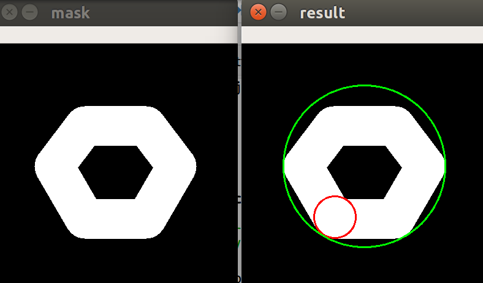

# 求任意 mask 的最大内接圆 - Python 实现

由于 cv2 没有最大内接圆实现, 所以分享一个最大内接圆的 Python 实现. 该代码支持任意形状的 mask/多边形/轮廓, 比如凸的, 非凸的, 镂空等各种场景. 

   

*效果图. 支持镂空情况, 红色的即为最大内接圆*

```python
import cv2
import numpy as np
def get_max_inscribed_circle(mask, approx_poly_epsilon=3):
    """
    Get the maximum/largest inscribed circle inside mask/polygon/contours.
    Support non-convex/hollow shape
    """
    if mask.dtype != np.bool:
        mask = mask > 0
    # Get the contours
    contours, _ = cv2.findContours(
        np.uint8(mask), cv2.RETR_TREE, cv2.CHAIN_APPROX_SIMPLE
    )[-2:]
    # Reduce points in contours
    contours = [cv2.approxPolyDP(cnt, approx_poly_epsilon, True) for cnt in contours]
    h, w = mask.shape
    ys, xs = np.mgrid[:h, :w]
    # Calculate the distances to the contours
    dist_map = np.zeros(mask.shape)
    dist_map[mask] = np.min(
        np.abs(
            [
                [  # Get min distance between point and cnt
                    cv2.pointPolygonTest(cnt, (x, y), True)
                    for y, x in zip(ys[mask].reshape(-1), xs[mask].reshape(-1))
                ]
                for cnt in contours
            ]
        ),
        0,
    )

    min_d, max_r, _, center_xy = cv2.minMaxLoc(dist_map)
    return center_xy, max_r


def get_test_mask():
    # Create an image
    r = 100
    mask = np.zeros((4 * r, 4 * r), dtype=np.uint8)

    # Create a sequence of points to make a contour
    vert = [None] * 6
    vert[0] = (3 * r // 2, int(1.34 * r))
    vert[1] = (1 * r, 2 * r)
    vert[2] = (3 * r // 2, int(2.866 * r))
    vert[3] = (5 * r // 2, int(2.866 * r))
    vert[4] = (3 * r, 2 * r)
    vert[5] = (5 * r // 2, int(1.34 * r))
    # Draw it in mask
    for i in range(6):
        cv2.line(mask, vert[i], vert[(i + 1) % 6], (255), 63)
    return mask


mask = get_test_mask()
center, radius = get_max_inscribed_circle(mask)
result = cv2.cvtColor(mask, cv2.COLOR_GRAY2BGR)
cv2.circle(result, tuple(center), int(radius), (0, 0, 255), 2, cv2.LINE_8, 0)

# minEnclosingCircle directly by cv2
contours, _ = cv2.findContours(mask, cv2.RETR_TREE, cv2.CHAIN_APPROX_SIMPLE)[-2:]
center2, radius2 = cv2.minEnclosingCircle(np.concatenate(contours, 0))
cv2.circle(result, (int(center2[0]), int(center2[1])), int(radius2), (0, 255, 0,), 2)

cv2.imshow("mask", mask)
cv2.imshow("result", result)
cv2.waitKey(0)
```

P.S. 由于我没有实时性需求, 并没有花时间优化速度.