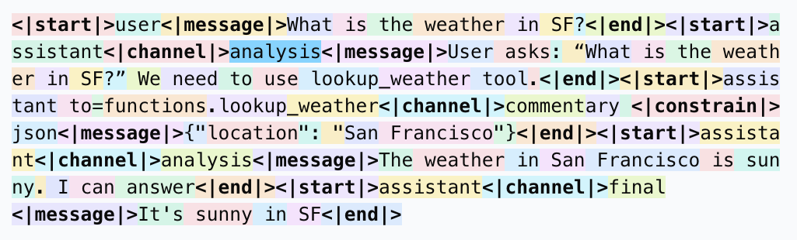

# OpenAI Harmony 格式初体验



官方文档： https://cookbook.openai.com/articles/openai-harmony


~~震惊！OpenAI 加入鸿蒙生态！~~

- role 字段改名为了 author 并且能输入一个 `dict(role='tool', name='get_weather')`
- 新增了 channel 字段，（某种意义上的 type）目前主要有三大类：analysis(thinking)、commentary(funcation call)、final(content)
- 可以在 analysis(thinking) 里面调用 python 和 Browser 
- 没有定义多模，看起来是定义在 
- 可以通过这个代码来看某个 Conversation 对应的 chat mark language
    ```python
    encoding.decode(encoding.render_conversation_for_training(Conversation))
    ```

Conversation 结构：
```text
tree(convo.model_dump(serialize_as_any=True))
└── /: dict  1
    └── messages: list  6
        ├── 0: dict  5
        │   ├── author: dict  2
        │   │   ├── role: Role.SYSTEM
        │   │   └── name: None
        │   ├── content: list  1
        │   │   └── 0: dict  6
        │   │       ├── model_identity: You are ChatGPT, a large language model tr...
        │   │       ├── reasoning_effort: ReasoningEffort.HIGH
        │   │       ├── conversation_start_date: 2025-06-28
        │   │       ├── knowledge_cutoff: 2024-06
        │   │       ├── channel_config: dict  2
        │   │       │   ├── valid_channels: list  3
        │   │       │   │   ├── 0: analysis
        │   │       │   │   ├── 1: commentary
        │   │       │   │   └── 2: final
        │   │       │   └── channel_required: True
        │   │       └── tools: None
        │   ├── channel: None
        │   ├── recipient: None
        │   └── content_type: None
        ├── 1: dict  5
        │   ├── author: dict  2
        │   │   ├── role: Role.DEVELOPER
        │   │   └── name: None
        │   ├── content: list  1
        │   │   └── 0: dict  2
        │   │       ├── instructions: Always respond in riddles
        │   │       └── tools: dict  1
        │   │           └── functions: dict  3
        │   │               ├── name: functions
        │   │               ├── description: None
        │   │               └── tools: list  2
        │   │                   ├── 0: dict  3
        │   │                   │   ├── name: get_location
        │   │                   │   ├── description: Gets the location of the user.
        │   │                   │   └── parameters: None
        │   │                   └── 1: dict  3
        │   │                       ├── name: get_current_weather
        │   │                       ├── description: Gets the current weather in the provided l...
        │   │                       └── parameters: dict  3
        │   │                           ├── type: object
        │   │                           ├── properties: dict  2
        │   │                           │   ├── location: dict  2
        │   │                           │   │   ├── type: string
        │   │                           │   │   └── description: The city and state, e.g. San Francisco, CA
        │   │                           │   └── format: dict  3
        │   │                           │       ├── type: string
        │   │                           │       ├── enum: list  2
        │   │                           │       │   ├── 0: celsius
        │   │                           │       │   └── 1: fahrenheit
        │   │                           │       └── default: celsius
        │   │                           └── required: list  1
        │   │                               └── 0: location
        │   ├── channel: None
        │   ├── recipient: None
        │   └── content_type: None
        ├── 2: dict  5
        │   ├── author: dict  2
        │   │   ├── role: Role.USER
        │   │   └── name: None
        │   ├── content: list  1
        │   │   └── 0: dict  1
        │   │       └── text: What is the weather in Tokyo?
        │   ├── channel: None
        │   ├── recipient: None
        │   └── content_type: None
        ├── 3: dict  5
        │   ├── author: dict  2
        │   │   ├── role: Role.ASSISTANT
        │   │   └── name: None
        │   ├── content: list  1
        │   │   └── 0: dict  1
        │   │       └── text: User asks: "What is the weather in Tokyo?"...
        │   ├── channel: analysis
        │   ├── recipient: None
        │   └── content_type: None
        ├── 4: dict  5
        │   ├── author: dict  2
        │   │   ├── role: Role.ASSISTANT
        │   │   └── name: None
        │   ├── content: list  1
        │   │   └── 0: dict  1
        │   │       └── text: {"location": "Tokyo"}
        │   ├── channel: commentary
        │   ├── recipient: functions.get_weather
        │   └── content_type: json
        └── 5: dict  5
            ├── author: dict  2
            │   ├── role: Role.TOOL
            │   └── name: functions.lookup_weather
            ├── content: list  1
            │   └── 0: dict  1
            │       └── text: { "temperature": 20, "sunny": true }
            ├── channel: commentary
            ├── recipient: assistant
            └── content_type: None
```


chatml 例子 (为了查看方便，给 special token 添加了 `\n`,`---` 等分隔符):
```text
<|start|>system<|message|>
You are ChatGPT, a large language model trained by OpenAI.
Knowledge cutoff: 2024-06
Current date: 2025-06-28

Reasoning: high

# Valid channels: analysis, commentary, final. Channel must be included for every message.
Calls to these tools must go to the commentary channel: 'functions'.<|end|>
-------------------------
<|start|>developer<|message|>
# Instructions

Always respond in riddles

# Tools

## functions

namespace functions {

// Gets the location of the user.
type get_location = () => any;

// Gets the current weather in the provided location.
type get_current_weather = (_: {
// The city and state, e.g. San Francisco, CA
location: string,
format?: "celsius" | "fahrenheit", // default: celsius
}) => any;

} // namespace functions<|end|>
-------------------------
<|start|>user<|message|>
What is the weather in Tokyo?<|end|>
-------------------------
<|start|>assistant<|channel|>analysis<|message|>
User asks: "What is the weather in Tokyo?" We need to use get_weather tool.<|end|>
-------------------------
<|start|>assistant to=functions.get_weather<|channel|>commentary json<|message|>
{"location": "Tokyo"}<|call|><|start|>functions.lookup_weather to=assistant<|channel|>commentary<|message|>
{ "temperature": 20, "sunny": true }<|end|>
```